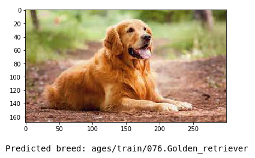

# dog-breed-classifier
An image classification pipeline that can be used within any kind of application (desktop, web or mobile) to process real-world, user-supplied images of dogs to identify the breed.

### Features: 
- Determines whether an image is a dog or not
- Estimate the breed
- Show statistics of the results.

